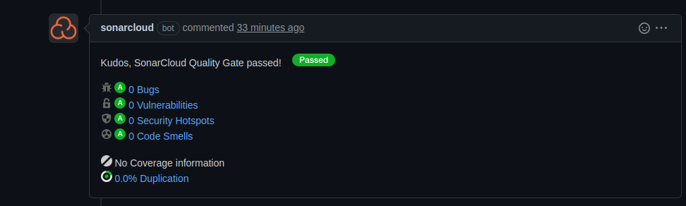
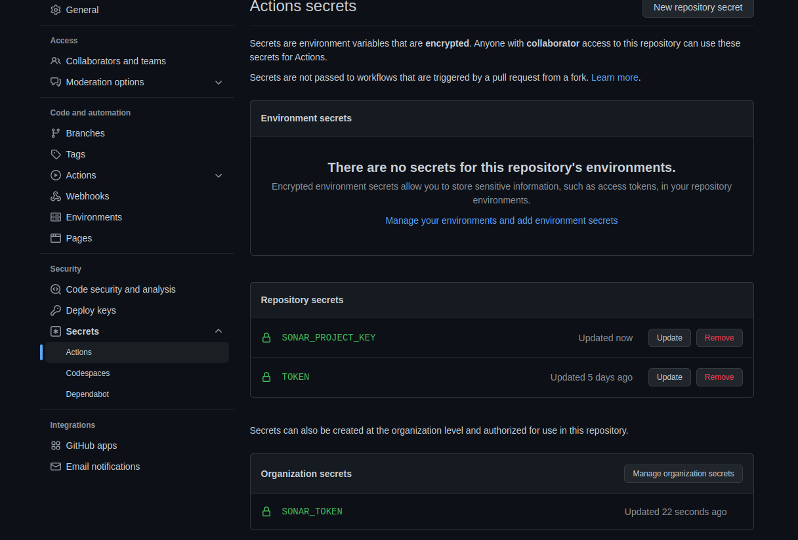

# SonarCloud

## What
[SonarCloud](https://sonarcloud.io/) is a cloud-based code analysis service designed to detect code quality issues in 25 different programming languages, continuously ensuring the maintainability, reliability and security of your code.

## Why
Helps us to assess the quality and security of our code in an easy way. It detects code smells, bugs and vulnerabilities.

## How

SonarCloud decorates your pull requests, giving you feedback such as a barometer on the quality of your PR and a quality gate indicator.

## CI setup

SonarCloud analysis is executed via the `sonarcloud` Github workflow in `.github/workflows/sonarcloud.yml`.

!!! summary

    A repository owner will need to set a `SONAR_PROJECT_KEY` Github secret variable.

Every repository will require a unique [project key](https://docs.sonarcloud.io/advanced-setup/analysis-parameters/). This must be configured as a Github secret variable in your repository settings. The variable name must be set to `SONAR_PROJECT_KEY`.

!!! tip

    The `SONAR_TOKEN` Github secret is set at the organizational level and is available for reuse in your repository.

## Local setup

There is the possibility to use [SonarLint](https://www.sonarlint.org/) locally as an extension but for the moment golang is not one of the supported languages.
